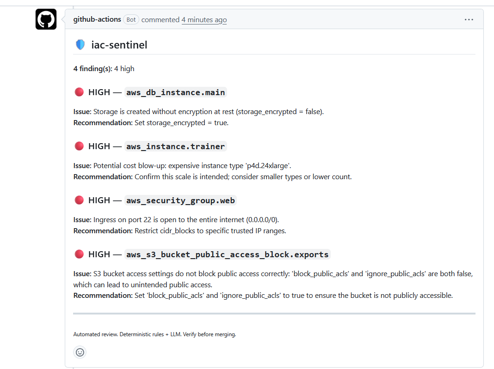

# 🛡️ iac-sentinel

**AI-assisted Terraform reviewer for pull requests.** It reads a `terraform plan`,
combines deterministic security/cost rules with an LLM, and posts a single,
always-up-to-date review comment on the PR.

> Built as a hands-on study of the DevOps × Agentic-AI intersection: IaC, CI/CD,
> structured LLM output, provider independence, and defense-in-depth.

---

## Use it in your repo (as a GitHub Action)

iac-sentinel is published as a composite Action, so **any repository can adopt it in
one step** — no install, no copied code. You generate a `plan.json` in your own
workflow and hand it to the action:

```yaml
- uses: onurglr/iac-sentinel@v1
  with:
    plan-path: plan.json
```

Here it is running in a **separate consumer repository**, reviewing a real
`terraform plan` end-to-end — three deterministic rules plus one risk the LLM found:



<b>Full workflow</b> — generate the plan, then review it:

```yaml
name: terraform-review
on: pull_request

permissions:
  contents: read
  pull-requests: write   # post the review comment
  models: read           # call GitHub Models (the LLM)

jobs:
  review:
    runs-on: ubuntu-latest
    steps:
      - uses: actions/checkout@v4

      # YOU generate the plan — with YOUR cloud credentials, in YOUR context.
      - uses: hashicorp/setup-terraform@v3
      - run: terraform init
      - run: terraform plan -out=tfplan
        env:
          AWS_ACCESS_KEY_ID: ${{ secrets.AWS_ACCESS_KEY_ID }}
          AWS_SECRET_ACCESS_KEY: ${{ secrets.AWS_SECRET_ACCESS_KEY }}
      - run: terraform show -json tfplan > plan.json

      # iac-sentinel reviews the plan — it never sees your cloud credentials.
      - uses: onurglr/iac-sentinel@v1
        with:
          plan-path: plan.json
          fail-on-high: "true"
```

### Why *you* generate the plan (and we don't)

**iac-sentinel reviews a plan; it deliberately does not generate one.** Generating a
real `terraform plan` requires the caller's cloud credentials, backend/state access,
and provider setup — all of which vary per cloud and belong to *your* repo, not this
tool. If the action generated the plan, it would have to **hold your cloud
credentials** — the wrong place for a security tool to sit. So you run
`terraform plan` in your own workflow (your context, your secrets) and hand us the
resulting JSON. The payoff: iac-sentinel stays **cloud-agnostic**, **credential-free**,
and keeps a **small attack surface**. This mirrors how tools like tfsec and checkov
consume plan output rather than producing it. See ADR-008 in
[`DECISIONS.md`](./DECISIONS.md).

### Action inputs

| Input | Default | Description |
|-------|---------|-------------|
| `plan-path` | `plan.json` | Path to the plan JSON (`terraform show -json`). |
| `fail-on-high` | `false` | Exit 1 (fail the job) if any high-severity finding is present. |
| `token` | `${{ github.token }}` | Token for GitHub Models + PR comment. |

## Why it exists

A `terraform plan` shows exactly what will change in your infrastructure — but on a
busy PR, risky changes (a security group open to `0.0.0.0/0`, an unencrypted
database, a 50× GPU cost blow-up) are easy to miss. iac-sentinel reviews the plan
automatically on every PR and surfaces the risks where the team already works.

## How it works

```
terraform plan (JSON)
        │
        ▼
   [ parse ]        keep create/update/delete; drop no-op/read noise
        │
        ├─────────────► [ rules ]  deterministic safety net (guaranteed floor)
        │                   │       0.0.0.0/0, unencrypted storage, cost blow-ups
        ├─────────────► [ LLM ]    contextual/novel risks (flexible ceiling)
        │                   │       via a provider-agnostic seam
        ▼                   ▼
      [ merge ] ── severity-sorted, de-duplicated ReviewResult
        │
        ▼
   [ report ]       scannable Markdown (badges, summary, hidden marker)
        │
        ▼
   [ publish ]      upsert one PR comment via the GitHub REST API
```

### Design highlights

- **Defense in depth.** Deterministic rules are the *floor*: obvious risks
  (`0.0.0.0/0`, missing encryption at rest, expensive/high-count compute) are
  caught **every time**, independent of the LLM. The LLM is the *ceiling*: it
  reasons about novel and contextual risks the rules can't enumerate. Neither
  layer alone is trusted.
- **Graceful degradation (fail-safe).** The LLM call is isolated in the
  orchestrator: if the model is down, rate-limited, or unauthenticated, the
  review **does not crash** — it falls back to the deterministic rules and posts
  a **visible** "AI review did not run — partial review" warning instead of
  silently masquerading as a clean bill of health. The failure reason is never
  echoed into the public comment (it could leak tokens/URLs).
- **Provider-agnostic.** All model access lives behind one seam (`llm.py`).
  The default provider is **GitHub Models** (OpenAI-compatible); switching
  providers touches only that file — no vendor lock-in.
- **Structured output.** The LLM is forced into a validated Pydantic schema, so
  results are machine-readable (severity as a closed set, not prose) — no fragile
  JSON string parsing.
- **Idempotent comments.** A hidden marker lets the tool update its own previous
  comment instead of spamming a new one on every push.
- **CI-native.** Ships as a GitHub Actions workflow with least-privilege
  permissions; optional `--fail-on-high` gates merges.

## Local usage (CLI)

```bash
pip install -e .

# Generate a plan
terraform plan -out=plan.tfplan
terraform show -json plan.tfplan > plan.json

# Review it (prints Markdown)
iac-sentinel --plan plan.json

# Review and post/update a PR comment (CI)
iac-sentinel --plan plan.json --comment
```

Set `GITHUB_TOKEN` (a token with `models: read`, plus `pull-requests: write` when
using `--comment`). Locally, put it in a `.env` file — see `.env.example`.

## Development

```bash
pip install -e ".[dev]"
pytest
```

The deterministic layer (parser + rules) is fully unit-tested — fast, no API,
no network. The LLM boundary is deliberately kept out of unit tests.

## Roadmap

- Make the LLM **agentic**: tool-use to query live cloud state / CVEs, multi-step
  investigation before judging.
- Observability (Langfuse): token cost & tracing per review.
- More rules (public S3, wildcard IAM, unencrypted volumes).

## Architecture decisions

See [`DECISIONS.md`](./DECISIONS.md) for the reasoned ADRs (input format, structured
output, the provider seam, the hybrid rules+LLM design, graceful degradation, and more).
